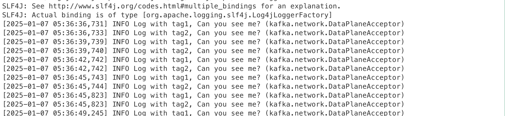

Tag Filtered Log API
=================
These api allow developers to include tags in their log messages. 
Logs are filtered based on tags configured in the log4j.properties file,
ensuring thant only relevant logs are displayed.

### Key Features ###

- **Tagged Logging**: Add tags to log messages to categorize and control their visibility.
  Log messages are shown in the form `[tag: {tag}] {message}` 
- **Configurable Filtering**: Specify which tags to display through the log4j.properties configuration.
- **Backward Compatibility**: Existing log APIs remain unaffected by the tag-based filtering, allowing them to function as before without modification.

### Logging API Methods ###

The following APIs are provided for logging at various levels with support for tagged messages:

```scala
  def traceWithTag(tag: => String, msg: => String): Unit
  def traceWithTag(tag: => String, msg: => String, e: => Throwable): Unit
  def debugWithTag(tag: => String, msg: => String): Unit
  def debugWithTag(tag: => String, msg: => String, e: => Throwable): Unit
  def infoWithTag(tag: => String, msg: => String): Unit
  def infoWithTag(tag: => String, msg: => String, e: => Throwable): Unit
  def warnWithTag(tag: => String, msg: => String): Unit
  def warnWithTag(tag: => String, msg: => String, e: => Throwable): Unit
  def errorWithTag(tag: => String, msg: => String): Unit
  def errorWithTag(tag: => String, msg: => String, e: => Throwable): Unit
 ```
### Configuration ###
#### Setting Tags Filter in log4j.properties
To specify which tags should be logged, update the following configuration in the right position of log4j2.yaml file.
```properties
  Filters:
    MarkerFilter:
      - marker: {1st tag}
        onMatch: ACCEPT
        onMismatch: NEUTRAL
      - marker: {2nd tag}
        onMatch: ACCEPT
        onMismatch: NEUTRAL
      ...
      - marker: {last tag}
        onMatch: ACCEPT
        onMismatch: DENY
```
- Replace {OO tag} with a tag that you want to enable for logging. Important thing is you should only set onMismatch to DENY on last tag.
- For more information, check it out on [the Log4j 2 Configuration Syntax](https://logging.apache.org/log4j/2.x/manual/configuration.html#configuration-syntax)

### Example ###
In this example, we added logs with tag in acceptor cycle to test and made only logs with the tags tag1, tag2 be displayed.
```properties
# @log4j.properties
  Appenders:
    Console:
      name: STDOUT
      PatternLayout:
        pattern: "${logPattern}"
      Filters:
        MarkerFilter:
          - marker: tag1
            onMatch: ACCEPT
            onMismatch: NEUTRAL
          - marker: tag2
            onMatch: ACCEPT
            onMismatch: DENY
```
```scala
// @SocketServer.scala > Acceptor > run()
override def run(): Unit = {
  serverChannel.register(nioSelector, SelectionKey.OP_ACCEPT)
  try {
    while (shouldRun.get()) {
      time.sleep(3000)
      infoWithTag("tag1", "Log with tag1, Can you see me?")
      infoWithTag("tag2", "Log with tag2, Can you see me?")
      infoWithTag("tag3", "Log with tag3, Can you see me?")
      try {
        acceptNewConnections()
        closeThrottledConnections()
      }
      catch {
        // We catch all the throwables to prevent the acceptor thread from exiting on exceptions due
        // to a select operation on a specific channel or a bad request. We don't want
        // the broker to stop responding to requests from other clients in these scenarios.
        case e: ControlThrowable => throw e
        case e: Throwable => error("Error occurred", e)
      }
    }
  } finally {
    closeAll()
  }
}
```

Below is an example of running the application with the above configuration and edited code.


